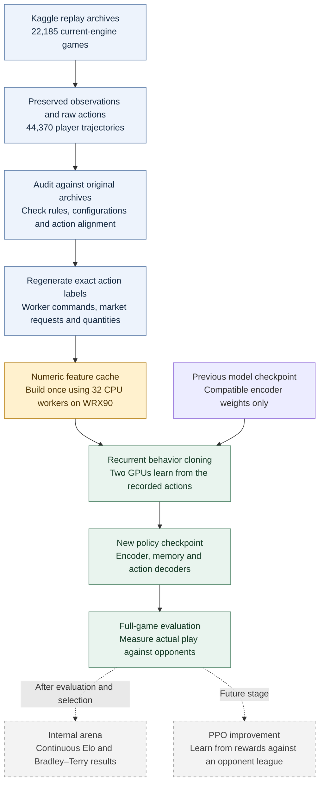
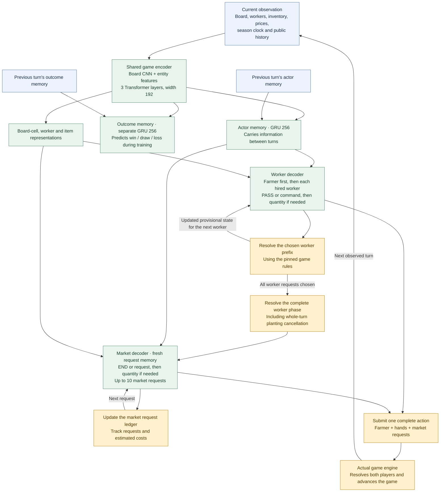

# Kaggriculture behavior cloning architecture

Snapshot: September 18, 2026. Based on the implemented `exact-bc-v1` code.

The system learns from recorded games, saves a policy checkpoint, and uses that
policy to choose worker actions and market requests. One model covers the whole
season. It has **5.31 million parameters**.

## Replay to trained agent

**Snapshot:** seven completed BC epochs and full-game evaluations are available. The numeric cache is complete. PPO integration remains future work.

All 44,370 trajectories are included, with no development or test holdouts.
Unsupported action labels are masked and counted without removing their games.
The vocabularies contain 34 worker quantity values and 233 market quantity values;
context and grammar determine which quantity choices apply.

## How the policy makes one turn's decisions

The encoder runs once per turn. The smaller decoders reuse its representations
while local features track changes from requests already chosen. They do not see
future recorded actions.

Worker states remain provisional until every worker request is known: an excess
of planting requests can cancel earlier planting of that crop. The market
decoder starts with the fully resolved worker state. Requested purchases do not
become inventory until the real game engine fills them.

During behavior cloning, recorded actions supply each decoder's preceding
choices. During play, the model's own choices supply them. Both paths use the
same action builders and game-rule logic.

## Training and hardware

| Part | Implementation |
|---|---|
| Replay preparation | WRX90 CPU; 32 parallel workers |
| Workstation | Threadripper PRO 9965WX; 24 cores / 48 threads; about 183 GiB system RAM |
| Neural training | Two RTX PRO 6000 GPUs, 96 GB each; PyTorch distributed data parallel |
| Proposed production batch | 64 player trajectories globally; chunks of 16 turns; BF16 |
| Season memory | Persists across all 719 turns; gradients stop at each chunk boundary |
| Training objective | Separate means for worker and market gate, command and quantity losses; outcome loss weighted 0.05 |
| Initialization | Compatible encoder weights may be reused; recurrent states, action heads and optimizer start fresh |
| Evaluation | Fresh full games first; internal arena results after an agent is added |

The current policy learns **both worker actions and economic market requests**.
Behavior cloning teaches it to reproduce recorded decisions. PPO is a later
improvement stage, not part of the current cache build or BC training job.

The arena is a separate evaluation service, previously configured to run on
the mini PC and Vast. Its live hardware status was not checked for this diagram.
Passing integration tests or reducing training loss does not establish playing
strength; full-game evaluation supplies that evidence.

## Code map

- `exact_features.py` and `exact_actions.py`: observation and action features.
- `exact_model.py`: shared encoder, recurrent states and action heads.
- `exact_decoder.py`: replay supervision and live decisions.
- `worker_phase.py`: pinned worker-phase game rules.
- `cache_exact.py`: regenerated labels and numeric cache.
- `exact_training.py` and `train_exact.py`: recurrent training and two-GPU execution.
- `exact_identity.py`: cache, source, engine and vocabulary compatibility.
