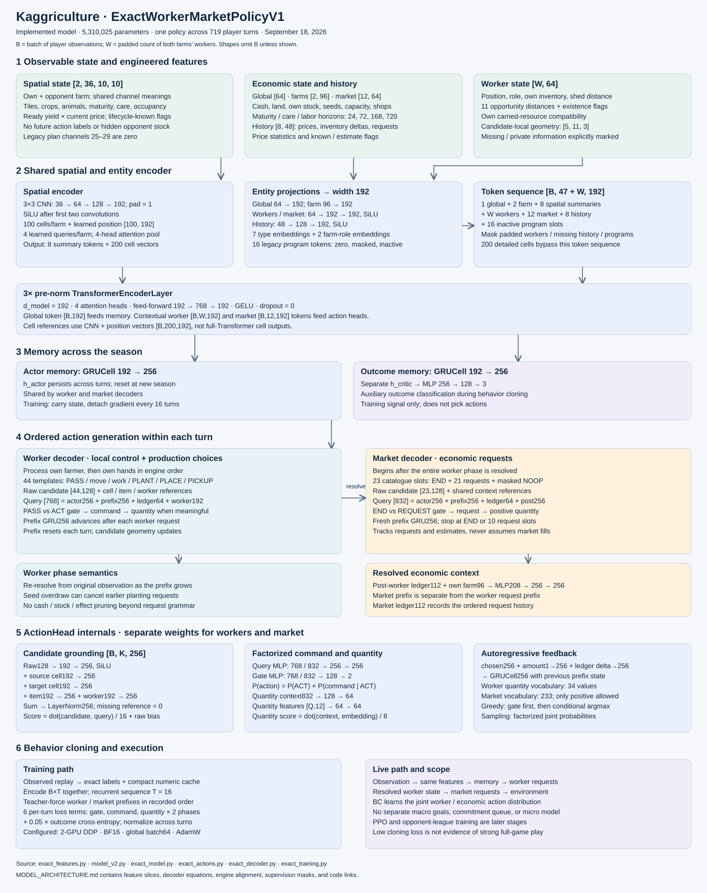

# Kaggriculture model architecture

Source snapshot: September 18, 2026. This describes `ExactWorkerMarketPolicyV1`, schema `exact-worker-market-bc-v1`, with **5,310,025 parameters**. It describes the implemented code, not a proposed architecture or evidence of playing strength.

[Open the zoomable diagram](model-architecture.html) · [Download the vector diagram](model-architecture.svg)



## What macro and micro mean in this implementation

The current model has **one shared encoder, one recurrent actor state, and two action decoders**. The worker decoder chooses movement, care, harvesting, planting, placement, and inventory commands. The market decoder chooses purchases, sales, hiring, and land requests after the worker phase. Both make decisions on each player turn; the same weights cover the whole season.

Economic reasoning spans both decoders. Planting and placing productive assets happen through worker commands, while hiring and buying inputs happen through market requests. Calling the market decoder “macro” and the worker decoder “micro” is therefore only a rough description of their roles.

**There is no separate learned macro policy that issues goals to a micro policy in this version.** There is no explicit commitment duration, latent strategy selector, or active job queue. Long-term information enters through season memory, maturity and labor features, market history, and the auxiliary outcome loss. This differs from the earlier macro-only plan. Some old program-shaped encoder inputs remain for compatibility, but they are zero and masked.

## 1. Observation and feature contract

Shapes below omit the batch dimension. `W` is the total number of workers on both farms, padded within a batch. Own farm precedes opponent farm. Missing opponent-private data stays zero with explicit known/role flags; zero alone does not mean a known empty inventory.

Counts, money, and many deltas use `sign(x) × log(1 + |x|) / 12`. Clocks and distances use fixed scale factors. These are engineered numeric inputs, not embeddings computed during preprocessing: the encoder still learns its representations during training.

| Input | Shape | Information |
|---|---|---|
| Board | `2 × 36 × 10 × 10` | Tiles, crops, animals, lifecycle, maintenance, workers, immediate harvest value |
| Global | `64` | Turn/day/hour, remaining season, reset, public shop counts |
| Farms | `2 × 96` | Cash, workforce, land, own resources, maturity and maintenance summaries |
| Workers | `W × 64` | Position, role, own inventory, opportunities and carried-resource compatibility |
| Market | `12 × 64` | Item identity, current prices/inventory, own stock, rule features and history statistics |
| History | `8 × 48` | Previous public changes and known own requests |
| Legacy programs | `16 × 96` | Zero and invalid; no active plan representation |

The 12 market items are WHEAT, CARROT, TOMATO, STRAWBERRY, MELON, EGG, MILK, WOOL, FERTILIZER, GOOSE, COW, and SHEEP. Input slice notation is zero-based and excludes the upper bound.

### Board channels

| Channels | Meaning |
|---|---|
| `0, 1, 2` | Locked, empty, weed |
| `3:8` | Five crop types |
| `8, 9` | Pasture, coop |
| `10:13` | Cow, sheep, goose |
| `13` | Current yield units, log-scaled |
| `14` | Age since planting/placement, divided by 30 |
| `15, 16` | Watered/fed today; cared today |
| `17, 18` | Remaining fertilizer days; consecutive missed water/feed days |
| `19, 20` | Farmer position; hand occupancy |
| `21:24` | Fertilizer available, remaining lifespan, pending care bonus |
| `24` | Worker count on tile |
| `25:30` | Disabled legacy plan channels; zero |
| `30:34` | Time until yield, ready harvest, water due, feed due |
| `34` | Ready yield valued at the current product price |
| `35` | Lifecycle information known |

Channel 34 is an immediate valuation, not a learned price forecast. Lifecycle features use the pinned game rules. They do not assert that future care will actually occur.

### Farm and economic features

| Slice | Meaning |
|---|---|
| `0:8` | Cash, worker count, hires today, land, own-role/private-known flags, disabled queue field, own shed room |
| `8:20`, `20:32`, `32:37` | Own shed, carried items, seeds |
| `37:49` | Asset counts |
| `49:53` | Assets reaching first maturity within 24, 72, 168, 720 turns |
| `53:57` | Nominal care/feed demand over the same horizons |
| `57:61` | Nominal workforce action capacity over those horizons |
| `61:65` | Disabled queued-work estimates |
| `65:77` | Ready product units |
| `77:89` | Disabled reservations |
| `89:95` | Known/source flags, including index 94 marking maintenance as an estimate |
| `95` | Unused |

The demand/capacity features expose economic constraints to the network; they are not an optimization solver. The model must learn how to trade off maturation time, labor, resources, and remaining season length.

### Worker geometry and opportunities

Worker inputs include position, main-farmer/hand identity, side, inventory, total carry, and shed distance. Legacy plan fields `6:8` and `22:33` are disabled. New slices are:

- `34:45`: nearest Manhattan distance to each of 11 opportunities, divided by 18.
- `45:56`: whether each opportunity exists.
- `56:61`: own carried seeds, wheat, fertilizer, sellable goods, and animal compatibility.

The opportunity types are shed, harvest, water, feed, care, fertilizer ready, fertilizable crop, empty tile, diggable tile, empty coop, and empty pasture. Candidate-local geometry adds `5 × 11 × 3` values: current position plus four adjacent directions, each with distance, improvement, and existence. An out-of-bounds direction keeps the location unchanged. Locked tiles do not automatically block movement.

These inputs provide useful geometry without selecting a destination or forcing a command. The decoder still scores the available request templates.

### Market and history features

Each market token begins with a 12-item one-hot identity, current price, public market inventory, own shed count, and own seed count. It adds carried inventory, known flags, input costs, crop/animal lifecycle rules, current history deltas, price/inventory change summaries, exponentially weighted price statistics, and recent own requests.

Each history row stores price changes `0:12`, public inventory changes `12:24`, own request signals `24:36`, clocks and cash changes `36:40`, known flags, and separate seed/product/animal/hire-land request indicators. Up to eight previous rows enter attention; the history helper also maintains running statistics.

**A market request is not an observed fill.** Public inventory changes cannot reveal the opponent’s private orders or uniquely attribute trades. The representation preserves that distinction and does not treat public inventory as a hard purchase cap.

Feature implementation: [exact_features.py](exact_features.py), [features_v2.py](features_v2.py), [bc_runtime.py](bc_runtime.py).

## 2. Learned spatial and entity representation

### Spatial path

The same CNN processes both farms:

```text
[B,2,36,10,10]
  reshape → [2B,36,10,10]
  Conv3×3 36→64, pad1 → SiLU
  Conv3×3 64→128, pad1 → SiLU
  Conv3×3 128→192, pad1
  flatten spatial axes → [2B,100,192]
  + learned positional embedding [1,100,192]
```

Four learned query vectors attend to each farm’s 100 cells using four attention heads. This produces four summary tokens per farm, eight total. Farm-role embeddings distinguish own and opponent summaries.

There are **two spatial outputs**: the eight pooled tokens enter the Transformer, while all 200 CNN-plus-position cell vectors remain available for candidate references. Detailed cell references do not pass through the full entity Transformer.

### Entity path and Transformer

| Group | Projection | Tokens |
|---|---|---:|
| Global | Linear `64→192` | 1 |
| Farm | Linear `96→192` | 2 |
| Spatial summaries | Attention pooling above | 8 |
| Workers | MLP `64→192→192`, SiLU | W |
| Market | MLP `64→192→192`, SiLU | 12 |
| Legacy programs | MLP `96→192→192`, SiLU; masked | 16 |
| History | MLP `48→128→192`, SiLU | 8 |

Seven learned type embeddings identify the groups. Farm tokens also receive farm-role embeddings. The concatenated tensor is `[B,47+W,192]`; inactive program tokens, padded workers, and absent history rows are masked as attention keys.

Three pre-norm Transformer encoder layers apply four-head attention and a `192→768→192` feed-forward network with GELU and zero dropout. The resulting global token feeds both recurrent memories. Contextual worker and market tokens feed the action decoders.

Implementation: [model_v2.py](model_v2.py), `MacroPolicyV2.encode_features`, reused by the exact policy. Only the encoder modules are reused; the old model’s action heads are not part of the exact policy.

## 3. Season memory and outcome prediction

Two independent `GRUCell(192,256)` modules consume the global token:

```text
actor_h(t)  = GRU_actor(global_token(t), actor_h(t−1))
critic_h(t) = GRU_critic(global_token(t), critic_h(t−1))
outcome_logits = MLP256→128→3(critic_h(t))
```

States persist across the season and reset between games. During training, state carries across 16-turn chunks but gradients stop at each chunk boundary. This lets the forward pass remember earlier turns without backpropagating through all 719 turns at once.

The critic branch predicts the three game-outcome classes during BC. It provides an auxiliary shared-encoder training signal; it does not search actions or select the next command. The actor memory feeds both decoders.

## 4. Worker decoder

The policy visits its farmer, then each hand in engine order. For each worker it scores 44 templates:

```text
15 basic commands: PASS, N, S, E, W, WATER, HARVEST,
  FERTILIZE, DIG, BUILD_COOP, BUILD_PASTURE, FEED,
  CARE, COLLECT_FERTILIZER, DROP
+ 5 PLANT crop templates
+ 12 PLACE item templates
+ 12 PICKUP item templates
```

For each worker, compact cached geometry expands into a `44×128` candidate feature matrix. The feature slices are operation identity `0:18`, item identity `18:30`, source tile `30:54`, target tile `54:78`, directional opportunities `78:111`, item features `111:119`, and season/bounds/seed-risk/remaining-worker/shed features `119:128`.

The 128-wide worker ledger records own inventory, shed and seeds, position, phase progress, provisional planting counts and seed margins, clocks, and cash. Its encoding is `128→128→64`. The acting worker’s contextual token supplies another 192 values.

The decoder first chooses PASS versus ACT, then a command conditional on ACT, then a quantity only when that command’s engine semantics use one. PASS still advances the within-turn prefix. There is one request per worker; no worker END token.

### Engine-aligned prefix state

Worker requests can interact: over-requesting seeds may cancel earlier planting requests. The worker-phase helper therefore resolves each growing prefix from the original observation with remaining workers treated as PASS. It does not assume each earlier effect is permanent.

Features are causal in the prefix. Future recorded worker commands never enter the current worker’s input. During training the preserved raw worker action drives the final state supplied to the market decoder, including extra raw entries that matter to engine semantics. If a canonical worker sequence does not reproduce the raw phase result, worker supervision for that turn is masked rather than taught incorrectly.

The request grammar intentionally includes syntactically valid commands that may have no effect. Affordability, stock, or estimated usefulness does not silently remove recorded actions from the model’s support.

## 5. Market decoder

After all worker requests resolve, the model builds:

```text
post_context = MLP208→256→256(
    resolved_initial_market_ledger[112] || resolved_own_farm[96])
```

This provides the actual resolved worker-phase resources. The market decoder also uses shared actor memory and the original encoded context. Its own autoregressive prefix starts at zero, independently of the worker prefix.

The catalogue has 23 indices: END, one masked legacy NOOP, and 21 request choices covering hiring, land, five seeds, two product purchases, three animal purchases, and nine sales. It generates up to 10 ordered slots. END stops generation; reaching the cap does not require an extra END action.

The 112-wide request ledger tracks quantities requested, estimated spend/income, hire/land counts, resource-known flags, and remaining slots. It never treats requested buys or sells as guaranteed fills. The fixed post-worker context and evolving request ledger serve different roles.

Invalid recorded market slots retain their position and mask that slot and its dependent suffix. They are not converted into END labels. Market quantities must be positive; affordability does not cap the quantity vocabulary.

## 6. Shared decoder design, separate weights

Worker and market heads have the same structure but independent parameters.

For candidate `i`:

```text
c_i = LayerNorm(
    MLP128→192→256(raw_i)
  + Linear192→256(source_cell_i)
  + Linear192→256(target_cell_i)
  + Linear192→256(item_i)
  + Linear192→256(worker_i))
```

A missing reference contributes zero. Cell embeddings come from the spatial CNN; item and worker embeddings come from the Transformer. Explicit item references are not populated for every non-item command; local tile features still carry the relevant crop/animal information.

```text
query_input_worker = actor256 || prefix256 || ledger64 || worker192  # 768
query_input_market = actor256 || prefix256 || ledger64 || post256    # 832
q = MLP(input→256→256)(query_input)
score_i = dot(c_i, q) / 16 + Linear128→1(raw_i)
gate = MLP(input→128→2)(query_input)
```

Command probabilities factor as:

```text
P(PASS or END) = P(gate=0)
P(command_i)   = P(gate=1) × P(command_i | gate=1)
```

This prevents the number of command alternatives from directly setting the PASS/END prior. Greedy execution chooses the gate first, then the conditional command; it does not take a single argmax over all joint probabilities. Stochastic execution uses the factorized joint distribution.

### Quantity head

```text
q_context = MLP832→128→64(actor256 || prefix256 || chosen256 || ledger64)
q_embedding = MLP12→64→64(quantity_features)
quantity_logits = dot(q_context, q_embedding) / 8
```

The audited worker vocabulary has 34 values. Engine-parsed zero/negative values remain representable where meaningful. The conservative market vocabulary has 233 values, with nonpositive values masked. Commands whose engine behavior ignores a quantity do not receive a quantity loss.

### Within-turn memory

After a request:

```text
feedback = chosen_embedding
         + Linear1→256(signed_log_quantity)
         + Linear(ledger_width→256)(delta)
prefix_next = GRUCell256→256(feedback, prefix)
```

Worker feedback represents the request, not a promised physical effect. Market feedback describes the request-ledger change. This prefix memory resets every turn and again when switching from workers to market. It is distinct from actor/critic memory, which persists across turns.

Implementation: [exact_model.py](exact_model.py), [exact_actions.py](exact_actions.py), [worker_phase.py](worker_phase.py), [exact_decoder.py](exact_decoder.py).

## 7. Replay supervision and recurrent training

The selected current-engine corpus contains 22,185 games, 44,370 player trajectories, and 31,902,030 player turns. Both seats are included. There are no held-out replay games in this run, as requested. This means training loss cannot serve as a held-out generalization estimate.

```text
Original observations + raw requests
  → engine/configuration and action-alignment audit
  → exact worker/market factors and quantity vocabularies
  → compact numeric feature cache with masks and provenance
  → recurrent teacher-forced behavior cloning
  → checkpoint
  → separate full-game playing-strength evaluation
```

The cache stores numeric features, compact candidate geometry, labels, masks, and event data. It does not store frozen neural representations. Cache identity pins source, engine, mechanics, and vocabulary information, so incompatible preprocessing cannot silently feed the trainer.

The encoder processes all `B×T` observations in a chunk together. Actor and critic GRUs then step through `T=16` in order. Decoder events are grouped by phase and autoregressive depth across those turns; each player-turn has its own prefix state. Worker candidates expand on the device from their compact cached form.

The BC objective sums six terms per player-turn: worker gate, conditional worker command, worker quantity, market gate, conditional market request, and market quantity. Each factor type averages its supervised events within the turn. An auxiliary outcome cross-entropy has weight 0.05. The trainer normalizes the summed objective over player-turns across ranks. The unweighted policy log density is tracked separately from these loss weights.

Configured production settings are two-GPU DDP, BF16, global batch 64 trajectories, 16-turn chunks, four loader workers per rank, AdamW at `1e-4`, gradient norm clip 1, and one epoch. These are configuration facts, not a claim that production training is currently running or that this is the best batch size.

Optional initialization copies only compatible `MacroPolicyV2` encoder weights. New worker-feature columns `34:64` and farm feature 94 start with zero projection weights to avoid inheriting obsolete meanings. Recurrent memories, action heads, and optimizer state start fresh.

Implementation: [exact_training.py](exact_training.py), [train_exact.py](train_exact.py), [cache_exact.py](cache_exact.py), [label_contract.py](label_contract.py).

## 8. What has and has not been established

Existing checks cover sequential versus packed training, gradients, causal prefixes, worker-phase resolution, factorized action densities, checkpoint compatibility, a full 719-action execution, and a small two-GPU full-season training diagnostic. These support implementation consistency. They do not show that BC produces a competitive agent.

The earlier architecture pursued macro imitation with an executor. The implemented exact model instead learns the joint worker and market behavior needed to execute complete turns. Economic features and recurrence may help it learn longer-term decisions, but the code does not guarantee an explicit economic plan. PPO, a fast neural opponent league, and arena promotion are later stages, not active components of this BC graph.

For current review evidence, see [PRO_FIX_REVIEW.md](PRO_FIX_REVIEW.md), [integration-receipt.json](integration-receipt.json), [direct-training-receipt.json](direct-training-receipt.json), and [reviewed-ddp-receipt.json](reviewed-ddp-receipt.json).
