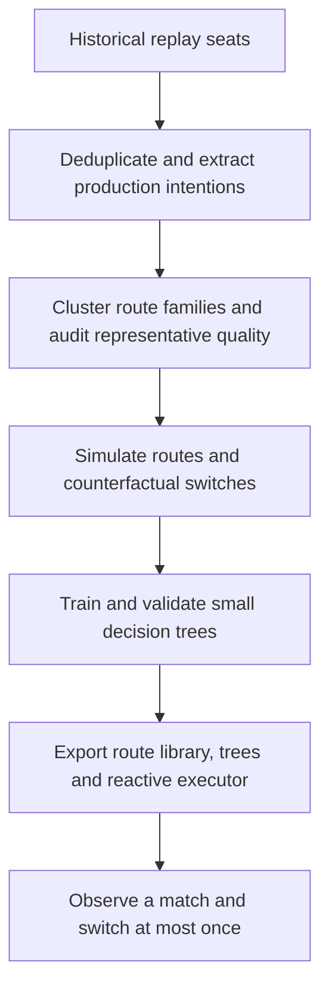
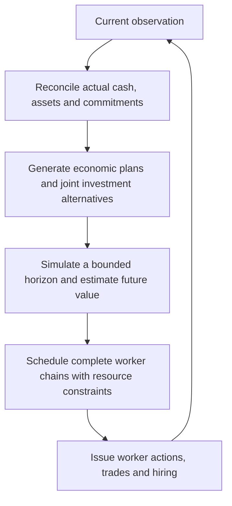

# Two Kaggriculture agent approaches

Publication date: 2026-09-11. This branch brings together the route-clustering agent from `main` and the P16 planning work from `agent/add-nt-simulator-orbit-migrations`. All documentation introduced or revised for this handoff is in English. Historical release documents remain with their original packages.

The two approaches solve different parts of the decision problem. **The route-clustering agent learns when to switch between previously observed farming strategies. The P16 agents construct economic plans from the current game state and coordinate workers to carry them out.** Neither published configuration is a newly trained neural network.

## Read the complete methods

1. [Route clustering and learned switching: philosophy, components, data, training, execution and reproduction](../../agents/route_clustering_switch_agent/docs/METHOD.md).
2. [P16 planning and execution: development sequence, the two JointAFS submissions, workflow repairs and reproduction](P16_METHOD.md).
3. [Publication provenance, exact versions and verification](PUBLICATION.md).

## What each agent actually contains

| Question | Route clustering and learned switching | P16 economic planning and worker coordination |
|---|---|---|
| Where does a farming strategy come from? | A representative historical replay supplies a route. Offline simulation searches when a different route becomes preferable. | Rules and dynamic programming propose crop, animal and investment plans from actual assets and resource constraints. |
| What is trained? | Small supervised decision trees, using labels generated by counterfactual simulated continuations. | No new neural training in these releases. The changes are planning, valuation, search and execution algorithms. |
| What is stored? | 175 route carriers, a reactive execution policy, feature code and three small decision trees. | C++ planner/executor code, frozen economic parameters, persistent commitment state and compiled libraries. |
| What changes during a match? | The initial route is fixed; three checkpoints may authorize one actual route switch. | Daily economic plans and step-level actions can change as resources, markets and observed outcomes change. |
| How are individual actions produced? | Select the current route's action tape at the current absolute step, then pass it through the reactive base policy. | Compile production intentions into purchases and dependent worker tasks, schedule them, issue one step and reconcile the next observation. |
| How does the opponent matter? | Training evaluates route opponents; online features include visible opponent state and public market conditions. | Public trades and visible production inform competition and supply forecasts; search values relative economic outcomes. |
| Main limitation | A finite route library, sparse switch times and imperfect compatibility between a new route and existing assets. | Bounded search and approximate future value can make a feasible plan economically inferior; timing and resource coordination remain difficult. |

These are separate deployable policies. This publication does not combine them into an ensemble or claim that one beats the other.

## Source and runnable entries

| Deliverable | Code | Runtime |
|---|---|---|
| Route-clustering switch agent | [Source and offline pipeline](../../agents/route_clustering_switch_agent/) | [Single-file agent](../../agents/route_clustering_switch_agent/main.py), [expanded runtime](../../agents/route_clustering_switch_agent/runtime/main.py) |
| Original JointAFS R1, submission `56146577` | [Full release source](../../nt/latest_20260911_p16_jointafs_r1/agent/) | [Original portable submission archive](../../nt/latest_20260911_p16_jointafs_r1/public_submission/AFS/submission.tar.gz) |
| Original JointAFS R2, associated with `56149565` | [Shipped Python wrapper and native library](../../evidence/r2p16_route_repair_20260911/opponents/submission_56149565/) | [Exact tested entry](../../evidence/r2p16_route_repair_20260911/opponents/submission_56149565/main.py) |
| Later JointAFS R1 and R2 with workflow repair | [R1 C++ source](../../nt/latest_20260911_afs_workflow_repair_r1_r2/r1/policy/), [R2 C++ source](../../nt/latest_20260911_afs_workflow_repair_r1_r2/r2/policy/) | [R1 entry](../../nt/latest_20260911_afs_workflow_repair_r1_r2/r1/main.py), [R2 entry](../../nt/latest_20260911_afs_workflow_repair_r1_r2/r2/main.py) |
| Local complete-workflow experiment | [Package](../../nt/latest_20260910_r2p16_route_workflow/) | [Entry](../../nt/latest_20260910_r2p16_route_workflow/main.py) |
| Local procurement-recovery experiment | [Package](../../nt/latest_20260910_r2p16_route_recovery/) | [Entry](../../nt/latest_20260910_r2p16_route_recovery/main.py) |
| Latest local procurement repair | [Source, tests and build instructions](../../nt/latest_20260911_r2p16_route_repair/README.md) | [Frozen entry](../../nt/latest_20260911_r2p16_route_repair/main.py) |

The two original submissions in this handoff are R1 `56146577` and the R2 package associated with `56149565`, as established in the prior acquisition record. The later workflow-repaired R1/R2 source packages are also included and explained separately. This is a dated identity statement, not a fresh claim about the latest submissions on Kaggle.

**The original R2 archive contains a compiled library, not the complete C++ source.** The later R2 workflow package provides inspectable related C++ implementation, but its binary is different and exact source parity with the original archive has not been established. We preserve both artifacts under their own identities.

## Development processes

The P16 development loop is broader than the match-time loop: reproduce an execution defect, formulate a general constraint or search change, test that contract, freeze the candidate and then evaluate paired seeds against multiple live opponents. A cleaner execution metric alone is insufficient evidence of stronger play.

## Evidence and the meaning of the numbers

The route-clustering release records a final holdout score of **89.615%**, compared with **81.176%** for its fixed-route baseline. That experiment uses 175 route-carrier opponents, 256 held-out seeds and both seats. Its score counts a draw as half a win. These are archived author results; the large search matrices and replay corpus are not included here, and this publication did not rerun that experiment.

The local P16 study contains **3,150 live matches** with compiled policies and the existing C++ simulator. Against original JointAFS R2, complete workflow won **61.0%**, old procurement recovery **62.5%**, and the latest local repair **48.5%**, each over 200 games. There were no draws. [Detailed evidence and negative findings](../../evidence/r2p16_route_repair_20260911/REPORT.md).

These percentages have different opponents, sample units and scoring definitions. They cannot rank the two approaches. The later JointAFS workflow-repair builds also have a separate author evaluation; they were not opponents in the local 100-seed R2 panel.

## How to work with this branch

Start with one method guide and use its frozen runtime before rebuilding. Keep data, native build outputs, caches and full replays outside tracked source directories. Preserve runtime hashes when making documentation changes. Put rebuilt candidates in new locations and label their configuration, compiler, simulator and opponent identities before comparing them.

For route clustering, inspect the quality gate before launching the expensive search. For P16, inspect both task completion and competitive economic outcomes. [Publication checks](PUBLICATION.md) distinguish artifact verification from a fresh tournament or competition-runtime certification.
