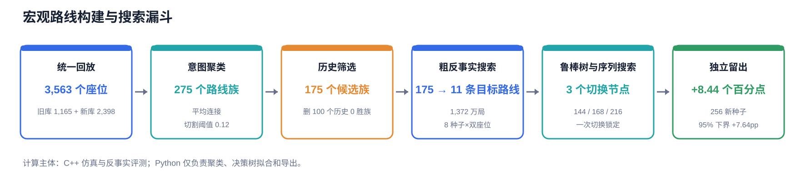
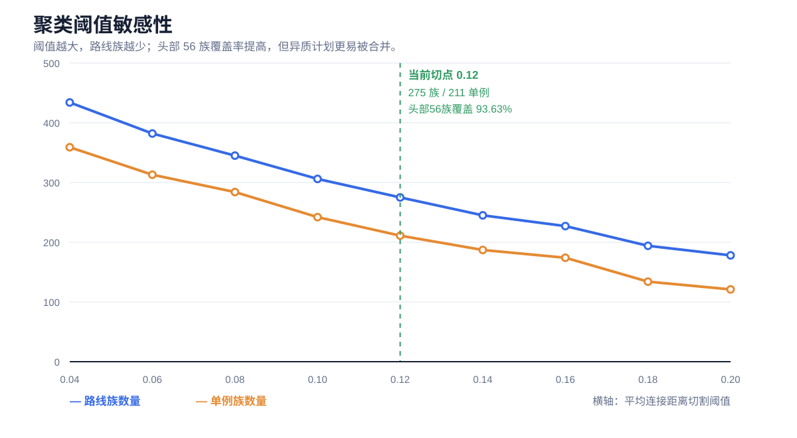
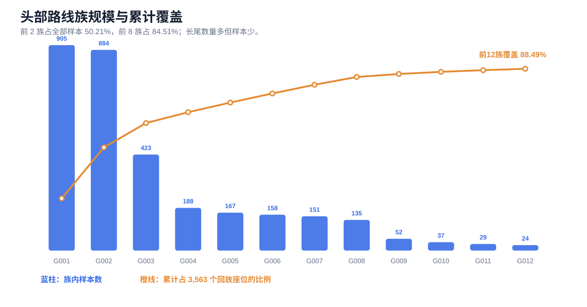
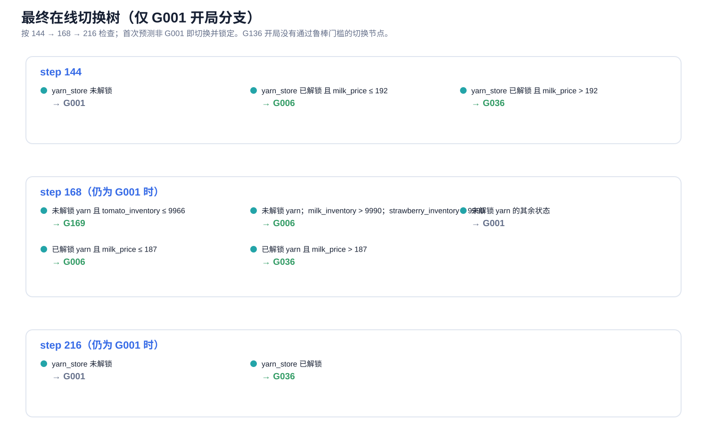
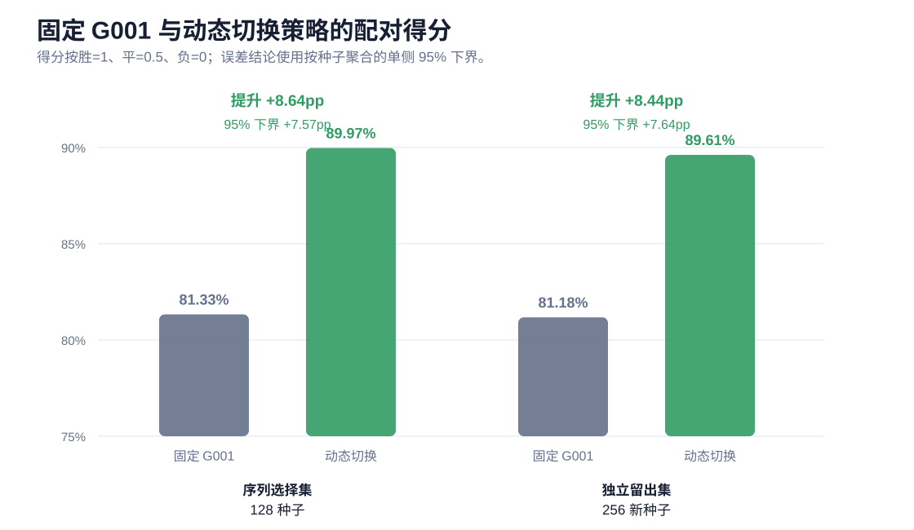

# 宏观路线去重、聚类、路线树与切换搜参

> 本文记录当前统一路线库（2026-08-25）的实际方法和结果。这里有两种“树”：**宏观路线族谱树**描述路线如何从相近计划逐级分化；**在线切换决策树**根据局内状态选择是否换路线。前者来自无监督聚类，后者来自 C++ 反事实对战标签，不能混为一谈。

## 1. 目标与原则

原始 replay 不能直接按动作序列去重：移动、除草、买卖时机、资金不足、杂草阻塞和订单未成交都会让同一经济计划产生不同动作轨迹。当前方案将路线身份定义为：

> **想种/养/建什么、放在哪里、在什么阶段扩张；不以动作是否成功作为路线身份。**

交易、移动、浇水、除草等执行动作不参与路线距离；历史输赢只用于聚类后的筛选，不参与路线身份计算，避免“赢得相似”取代“计划相似”。

## 2. 数据统一与意图恢复

| 项目 | 当前值 |
|---|---:|
| 旧回放库 | 1,165 个座位 |
| 新增榜单回放 | 2,398 个座位 |
| 合并后唯一回放座位 | **3,563** |
| Episode 范围 | 93,803,702—98,440,493 |

合并键为 `(episode_id, player_index)`；两批数据没有重复。每条 replay 用 C++ 仿真器重放 719 回合，同时保留两套信息：

- **计划意图**：从发出的 `PLANT / BUILD_COOP / BUILD_PASTURE / PLACE animal` 指令恢复预定生产位置，即使该动作因缺钱、杂草或状态不符而失败也计入意图。
- **执行诊断**：单位动作失败、市场订单未成交、完成率、最低现金、奖励重放误差等，只作为路线质量诊断，不进入聚类距离。

宏观意图由两个张量表示：

| 张量 | 形状 | 内容 |
|---|---|---|
| `L[a,t]` | `5 × 100` | 第 `a` 个锚点的 10×10 预定生产布局；锚点为 168、288、432、576、719 |
| `S[p,k]` | `10 × 12` | 每 72 回合阶段的宏观动作计数 |

布局的 10 类为 5 种作物、鹅/牛/羊、鸡舍、牧场；阶段动作再加入 `buy_land` 和 `hire`，共 12 类。阶段比较使用**累计计数**，因此同一动作跨过一个 72 回合边界只造成小的时间差，不会立刻变成新路线。

局限：这里恢复的是“脚本发出的意图”，不是自动合成的无失败最优脚本。代表 replay 仍可能带有坐标偏移或执行失败；后续对战会真实惩罚不兼容路线，但当前流程不会凭空补出一条从未出现过的完美路线。

## 3. 路线距离与去重聚类

设路线为 `i,j`，布局锚点为 `a`，类别为 `k`，格子为 `t`，阶段为 `p`。

### 3.1 三个距离分量

**生产构成距离**：比较每个锚点各类生产物数量，忽略具体格子。

\[
C_a(i,j)=\frac{\sum_k|n_{iak}-n_{jak}|}{\max(8,N_{ia},N_{ja})},\qquad C=\frac{1}{5}\sum_a C_a
\]

**农田布局距离**：在两条路线至少一方占用的格子并集上计算类别不一致率。

\[
G_a(i,j)=\frac{\sum_t \mathbf 1[L_{iat}\ne L_{jat}]}{\sum_t\mathbf 1[L_{iat}\ne0\lor L_{jat}\ne0]},\qquad G=\frac{1}{5}\sum_aG_a
\]

**宏观时序距离**：令 `Q[p,k]=Σ(q≤p)S[q,k]`，比较每阶段末累计宏观动作。

\[
T_p(i,j)=\frac{\sum_k|Q_{ipk}-Q_{jpk}|}{\max(6,\sum_kQ_{ipk},\sum_kQ_{jpk})},\qquad T=\frac{1}{10}\sum_pT_p
\]

最终距离：

\[
\boxed{D(i,j)=0.45C+0.35G+0.20T}
\]

权重含义：生产组合决定经济计划主体；布局区分同产物但农田组织不同的路线；累计时序用于区分扩张节奏，但降低偶然延迟的影响。全部 `3,563×3,563` 距离由 OpenMP C++ 计算。

### 3.2 聚类与阈值

使用预计算距离的**凝聚层次聚类**，连接方式为 average linkage：

\[
d(A,B)=\frac{1}{|A||B|}\sum_{i\in A,j\in B}D(i,j)
\]

由单条 replay 自底向上合并，天然形成一棵路线族谱树；在距离 `0.12` 横切得到当前全局编号。编号按“族规模降序 → 历史奖励中位数降序 → 原始标签”重排为 `G001...`，因此**数据集或阈值改变后必须整体重聚类并统一编号，不能直接拼接旧 G 编号**。

当前切点结果为 **275 族，其中 211 个单例族**。阈值不是数学真值：`0.04→434` 族、`0.20→178` 族，说明头部族较稳定、长尾对阈值敏感。阈值 0.12 的理由是保留明显布局/节奏差异，同时头部 56 族已覆盖 93.63% 样本；若目标改为发现微小克制路线，应降低阈值并承担更多长尾噪声。

前两族即覆盖 50.21%，前八族覆盖 84.51%。因此“275 族很多”主要是长尾现象，不代表存在 275 条同等重要的主流计划。

## 4. 族代表、共识计划与筛选

对每个族 `A`，实际可执行代表取族内 **medoid**：

\[
r_A^*=\arg\min_{i\in A}\frac{1}{|A|}\sum_{j\in A}D(i,j)
\]

它是离同族其他样本平均最近的真实 replay，比随意挑最高分样本更能代表族中心。另对阶段动作逐格取中位数并四舍五入，得到 `consensus schedule`，用于描述和别名；它不保证本身是一条可执行动作带。每族同时记录代表的硬失败数、完成率、最低现金与未来资本需求，便于识别“计划正确但执行脆弱”的路线。

筛选规则是删除历史样本中 `wins=0` 的族：`275 → 175`，保留 3,448/3,563=**96.77%** 的样本，删除 100 个族、115 个长尾样本。该规则是算力与噪声控制，不是“0 胜必然无价值”的统计证明；尤其单例族证据很弱，若获得更多回放应重新评估，而不是永久拉黑。

## 5. 从路线库到在线切换树

### 5.1 开局矩阵与纳什混合

先让 175 条代表路线全互打：每对使用相同 seed、交换两个座位，64 个 seed，共 **1,948,800 局**。这样地形/随机事件和座位差异被完全配对。经验收益矩阵上求零和纳什混合，当前支持为：

| 开局路线 | 权重 | 对 175 族平均得分 |
|---|---:|---:|
| G001 | 36.36% | 82.29% |
| G136 | 63.64% | 86.41% |

经验博弈值为 0.5。这里的纳什只针对当前 175 个 replay 代表，不保证对榜单未知脚本仍是均衡；G136 是小样本长尾路线，其高权重尤其需要外部对手验证。

### 5.2 C++ 反事实标签

对每个 `(开局路线, checkpoint, 对手族, seed, 座位)`：

1. 用开局路线打到 checkpoint，抽取同一个 147 维状态 `x`；
2. 从该时刻起分别接上每条候选路线在**同一时间索引**的后缀；
3. 保持对手、seed、座位完全相同，打完后按“胜/平/负优先，现金差仅作同结果内破平”选最佳目标；
4. 得到监督样本 `(x, 最佳目标路线)`，再训练浅决策树。

切换不是重放目标路线前缀，也不假设开局前知道对手。目标后缀若依赖未建成的农田/动物，会在真实仿真中失败并降低成绩；执行器只做原有的动作对齐、杂草修补和市场逻辑。因此反事实搜索同时学习“哪条路线克制当前状态”和“此时接过去是否兼容”。

147 个特征分为：己方公开农场状态、对手公开农场状态、己方仓库/种子/携带物、市场库存与价格、商店解锁、时间、双方现金/杂草/损失历史，以及当前路线未来 24/48/72 回合的费用、资本瓶颈、现金余量、雇工/买地/买动物需求。标签空间很大，所以分两级搜索：

| 阶段 | 搜索维度 | 局数 | 作用 |
|---|---|---:|---|
| 粗搜 | 2 开局 × 14 时点 × 175 目标 × 175 对手 × 8 seed × 2 座位 | **13,720,000** | 扫全目标库 |
| 贪心压缩 | 初始保留 G001/G136；每次加入使配对 oracle 得分至少提高 0.0005 的路线 | — | 175 目标压到 11 |
| 精搜 | 2 开局 × 7 时点 × 11 目标 × 175 对手 × 128 seed × 2 座位 | **6,899,200** | 低方差训练数据 |

最终 11 条目标为 `G001, G136, G006, G036, G126, G169, G227, G245, G093, G008, G013`。压缩优化的是“所选集合能够达到的配对 oracle 得分”，不是按单条路线平均胜率取前 11，因此会保留低频但在特定状态有边际价值的路线。

## 6. 决策树与超参数搜索

每个 `(开局, checkpoint)` 单独训练 `DecisionTreeClassifier`。本轮实际网格为：

- `max_depth ∈ {2,3,4}`；
- `min_samples_leaf ∈ {512,1024,2048}`；
- 5 折 seed 分组交叉验证与 5 折对手族分组交叉验证；
- 所有分裂阈值统一向 `±5% × (训练集特征 p95−p05)` 扰动，再测 8 组确定性混合方向；
- 按 seed 聚合配对收益差，计算 Student-t 单侧 95% 下界；
- 64 次按 seed bootstrap，审计根特征组出现率与阈值 `p10/p90` 稳定性。

模型选择指标不是分类准确率，而是：

\[
R_{robust}=\min(\Delta_{seedCV},\Delta_{opponentCV},\Delta_{threshold\ worst},LCB_{95\%})
\]

节点启用要求 `R_robust ≥ 0.01`，且 bootstrap 中最大根特征组频率至少 0.35。在最佳鲁棒得分 0.005 以内优先选更浅、叶子更大的树。这样避免“最佳路线标签预测很准，但换过去并没有真正多赢”的伪提升，也避免阈值轻微变化就翻转大量样本。

候选 checkpoint 为 `72,96,120,144,168,216`，穷举全部 63 个非空组合。在线只允许**一次切换**：按时间依次检查，首次预测不同于开局路线便切换并锁定。128 个新 seed、175 对手、双座位的序列搜索共 **2,867,200 局**，以单侧 95% 下界优先、节点数次优选择 `[144,168,216]`。

## 7. 最终在线规则与验证

最终有效节点只出现在 **G001 开局**；G136 的候选切换均未通过鲁棒门槛。树虽输入了己方、对手、资金瓶颈等 147 维特征，最终选择的主要是 yarn 商店解锁、市场奶价以及番茄/草莓/牛奶库存。这说明当前数据中最稳定的切换信号更像“市场阶段/供需状态”，而非直接识别某种动物就猜对手脚本。它是数据搜索结果，不是预先手写的启发式。

| 数据集 | 固定 G001 | 动态切换 | 提升 | 单侧 95% 下界 | 切换率 |
|---|---:|---:|---:|---:|---:|
| 序列选择：128 seed | 81.33% | 89.97% | +8.64pp | +7.57pp | 42.69% |
| 最终留出：256 未见 seed | 81.18% | 89.61% | **+8.44pp** | **+7.64pp** | 42.02% |

最终留出包含动态与固定基线各 `175×256×2=89,600` 局，共 **179,200 局**。此结论严格表示：“在当前 175 个代表对手上，G001 分支的动态切换优于固定 G001”；它不是整个纳什开局混合、社区 notebook 或真实榜单的总体胜率。

## 8. 防过拟合边界与下一步

| 已处理风险 | 方法 | 尚未解决的问题 |
|---|---|---|
| 随机开局方差 | 同 seed、双座位完全配对 | 仿真器与 Kaggle 官方环境的系统偏差 |
| seed 过拟合 | seed 分组 CV + 未见 seed 留出 | 榜单分布可能不同 |
| 对手族记忆 | 对手族分组 CV | 175 个对手仍来自同一回放生态 |
| 阈值敏感 | 分裂阈值扰动 + bootstrap | 市场阈值可能是仿真细节代理变量 |
| 树过复杂 | 浅树、大叶、简化容差 | 单次切换限制可能错过真正的恢复路线 |
| 路线后缀不兼容 | 直接在仿真中承受失败 | 尚未自动合成无失败的宏观计划执行器 |

下一轮最有价值的改进不是继续加深树，而是：用社区 notebook/官方环境做外部分布复验；按族支持度对对手加权并同时报告均匀权重结果；给长尾高价值路线补充样本；将 medoid 动作带升级为“宏观意图 + 状态可行性执行器”，从根本上解决资金、杂草和路线后缀不兼容，而不是依赖 replay 碰巧能接上。

## 9. 可复现产物索引

| 内容 | 文件 |
|---|---|
| 合并清单 | `experiments/macro-route-unified-20260825/merge-summary-v1.json` |
| 意图特征与执行审计 | `features-v1.npz`、`execution-audit-v3.npz` |
| 距离、聚类与敏感性 | `intent-distance-v1.f32`、`intent-clusters-v1.npz`、`intent-clusters-summary-v1.json` |
| 275 族定义与 175 族筛选 | `macro-intent-routes-v2.json` |
| 175 族全互打与纳什 | `intent-175-round-robin-64seeds-*`、`intent-175-nash-64seeds-v2.json` |
| 粗搜与 11 路线压缩 | `intent-175-switch-coarse-*`、`intent-175-switch-coarse-analysis-v1.json` |
| 精搜与鲁棒树 | `intent-11-switch-fine-*`、`intent-11-switch-robust-trees-128seeds-v2.json` |
| checkpoint 组合与最终留出 | `intent-11-switch-sequence-search-128seeds-v1.json`、`intent-11-switch-final-holdout-256seeds-v1.json` |
| 图表生成脚本 | `scripts/render_macro_route_method_charts.py` |
